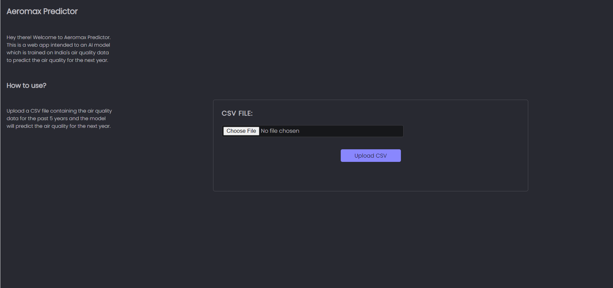
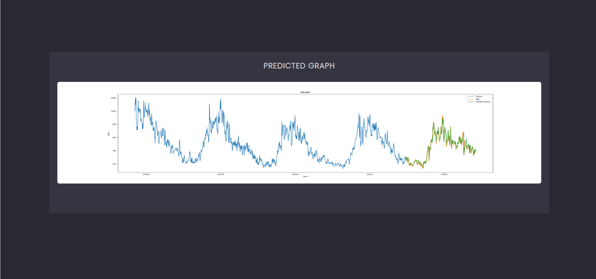

# Aeromax Predictor 🍃📈
> **Project Idea for Geeks-for-Geeks EcoTech Hack-A-Thon🚀**


## Table of Contents

- [Introduction](###Introduction)
- [Repository Structure](###Repository-Structure)
- [Requirements](###Requirements)
- [Installation](###Installation)
- [Usage](###Usage)
- [Benifits](###Benifits)
- [Future Scope](###Future-Scope)
- [Team Members](###Team-Members)
- [Deployment](###Deployment)


### Introduction
A LSTM model which is integrated to a web-app built on django rest framework. The model is trained on [India's air quality dataset]() which can predict air quality index graph of the next year. The model is trained on the dataset from 2015 to 2021 and the model is tested on the dataset of 2022. And this LSTM model integrated to a web app so it can be used more easily. All you have to do is to upload the csv file and the predicted graph will be shown in result page.

#### Glimpse of the project

Here are some screenshots of the project. The first one is the homepage of the web app in which you can upload your csv file and the second one is the result page in which you can see the predicted graph of the next year.

| **`Home page`** | **`result page`** |
|:---:|:---:|
|||

### Repository-Structure
This is how the repository is structured. The repository contains the dataset, model, webapp, notebook, saved_model, media, docs and the manage.py file.


```bash
├───aeromax_predictor
│   ├───app
│   │   ├───migrations
│   │   ├───templates
│   │   │   └───app
│   │   │          index.html
│   │   │          result.html
│   │   |───static
│   │   │   └───styles.css
│   ├───dataset
│   │   └───dataset.csv
│   ├───docs
│   │   └───screenshots
│   │   |      └─── aeromax_predictor_ss1.png
│   │   |      └─── aeromax_predictor_ss2.png
|   |   └─── videos
|   |   └─── presentation
|   |   └─── index.html
|   |   └─── README.md
│   ├───media
│   │   └───uploads
│   │       └───dataset.csv
│   ├───model
│   │   └───model.py
│   ├───notebook
│   │   └───model.ipynb
│   ├───saved_model
│   │   └───model.h5
│   ├───webapp
│   │   └───settings.py
│   │   └───urls.py
│   │   └───wsgi.py
│   ├───.gitignore
│   ├───manage.py
```
### Requirements
To install all the requirements run the following command in your terminal.
```bash
pip install -r requirements.txt
```
### Installation
To install the project in your local machine run the following command in your terminal.

- [ ] Clone and Install all the requirements :
```bash
    git clone https://github.com/vivek09thakur/Aeromax_Predictor.git
    pip install -r requirements.txt
```
- [ ] Change the directory :
```bash
    cd Aeromax_Predictor
```
- [ ] Make migrations :
```bash
    python manage.py makemigrations
    python manage.py migrate
```
- [ ] Run the server :
```bash
    python manage.py runserver
```
### Usage

**Using the web app**
- [ ] Open the browser and go to the following url : **`http://Areomax.render.com**
- [ ] Upload the csv file and click on upload button.
- [ ] The predicted graph will be shown in the result page.

**Using the model**
- [ ] Open the notebook and run all the cells.
- [ ] The model will be trained and saved in the saved_model folder.
- [ ] You can use the model by loading the model.h5 file.

### Benifits
- The model can predict the air quality index of the next year.
- It can be used to predict the air quality index of any city of India.
- It can be used to predict the air quality index of any country by training the model on the dataset of that country.
- Government of india can take action according to the predicted graph to reduce the air pollution.

### Future Scope

- [ ] The model can be trained on the dataset of any country to predict the air quality index of that country.
- [ ] We can add more features to the web app to make it more user friendly.
- [ ] We can implement the model in real life to predict the air quality index of any city of India.
- [ ] We can use a language model to advice the government to take action according to the predicted graph to reduce the air pollution.

### Team-Members
- [Vivek Thakur](https://github.com/vivek09thakur)
- [Dainwi Choudhary](https://github.com/dainwi)
- [Subhashree Pandey](#)